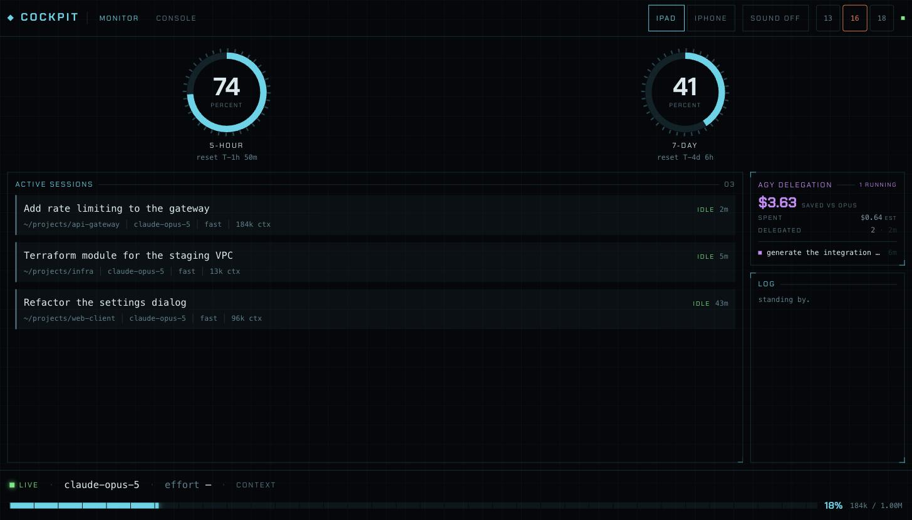
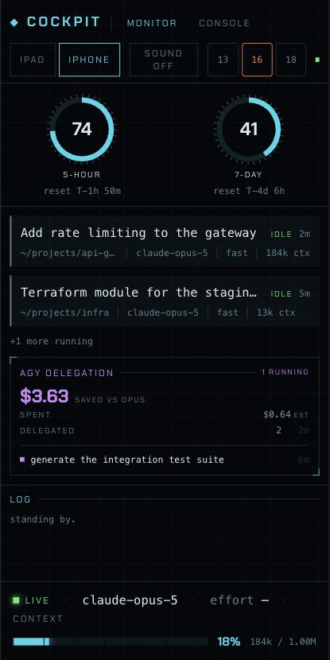

# Glass Cockpit


**An instrument panel for [Claude Code](https://claude.com/claude-code), for the
tablet you stopped using.**

Aviation calls it a glass cockpit when the dials come out and vector displays go
in. Same idea here: a spare iPad on the wall, showing how much of your rate limit
is gone, which sessions are alive, which one is stuck waiting on you, and what
your delegated work is costing — all of it legible from across the room, none of
it needing a click.



<p align="center">
  
</p>

<p align="center"><em>Landscape on a tablet, portrait on a phone. Screenshots run on synthetic data.</em></p>

> **Credit where it's due.** This is a modified build of
> **[hungnv26/claude-cockpit](https://github.com/hungnv26/claude-cockpit)** by
> Hung Ngo, used under MIT. Every hard part — the session watcher, the transcript
> tailer, the self-refreshing Keychain token, the console, the launchd service —
> is his. What's mine is the skin and the agy panel, both described below. His
> README is worth reading for the engineering rationale; this one won't repeat it.

---

## The instrument panel

Everything is drawn in one visual language: hairline boxes with the corners cut
away, tick rings around every gauge, tracked-out caps for labels, and a survey
grid so faint you notice it only as depth. One accent per meaning and no more —
cyan is structure, green is running, amber is *you are the bottleneck*, violet is
delegated work.

| | |
|---|---|
| **Rate limits** | Your 5-hour and 7-day windows as tick-ring gauges, each counting down to reset. They go amber near the ceiling. |
| **Sessions** | Every live Claude Code session — the desktop app's included — with a status rail down the left edge you can read from two metres away. |
| **Delegation** | What agy was handed and what that saved. Details below. |
| **Log** | Session events as they land, timestamped like a flight recorder rather than "3m ago". |
| **Context** | A segmented scale along the bottom edge, ticked every 40px, for the focused session's context window. |

Tap **console** and it stops being a dashboard: spawn a session the board owns,
prompt it, switch model or effort mid-conversation, and approve or deny tool calls
from the couch.

### Delegation, priced honestly

If you hand work to [Antigravity](https://antigravity.google) (`agy`), this panel
tells you what that was worth. It reads whichever of these your setup produces:

| Source | Written by |
|---|---|
| `~/.claude/agy-usage.log` | `agy-delegate`, on every synchronous run, when `AGY_USAGE_LOG` is set |
| `~/.antigravity-jobs/` | `agy-job start`, for background jobs |

It leads with **spend avoided on the orchestrator model**, not a quota gauge —
because agy publishes no usage or rate-limit API. There is no `agy usage`
subcommand and the desktop app keeps only Electron state, so any limit ring here
would be invented. Two caveats the UI states rather than hides:

- **Costs are estimates** (`EST`), priced from the plugin's own `prices.json` at
  the default **flash** tier. Neither source records a tier per run, so anything
  you ran at `--tier pro` reads low.
- **Totals are cumulative, not daily.** The usage log has no per-line timestamps —
  only the file's mtime, which dates your most recent delegation.

Never delegated anything? The panel doesn't render. No dead rectangle on your wall.

---

## Running it

**You need:** macOS, Node 20+, [pnpm](https://pnpm.io), Claude Code, and one
`claude auth login` so the usage gauges have a token.

```sh
pnpm install
pnpm dev                # web on :5199, API + socket on :5200
```

The server prints a URL with an access token in it. Open that on the tablet once,
then **Share → Add to Home Screen** for a fullscreen kiosk with no browser chrome.

### Leaving it up

```sh
pnpm build
sh service/install.sh   # per-user LaunchAgent: starts at login, restarts on crash
```

| | |
|---|---|
| Restart after a rebuild | `launchctl kickstart -k gui/$(id -u)/com.cockpit.server` |
| Stop | `launchctl bootout gui/$(id -u)/com.cockpit.server` |
| Watch the logs | `tail -f service/cockpit.log` |

Two things that will bite you eventually. **The Mac has to stay awake** —
`sudo pmset -a sleep 0` handles it; the display may still sleep. And **the LAN
address is DHCP**, so a router reboot can break the home-screen shortcut. Reserve
the address, or use the Bonjour name (`your-mac.local:5200`) instead.

If the gauges ever read *usage temporarily unavailable*: a restart empties the
usage cache, and restarting repeatedly earns a 429 with a three-minute backoff.
It clears itself. Wait rather than restart again.

---

## Layout

The header switches between the two shapes, and defaults to whichever matches the
viewport — a phone lands in portrait, a tablet in landscape.

| | Landscape | Portrait |
|---|---|---|
| Gauges | full size, side by side | smaller, in a row |
| Body | sessions beside a right rail | one scrolling column |
| Sessions | all of them | the two most recent |
| Rail | delegation above the log | stacked under the sessions |

Both honour the iOS safe areas, so the header clears the notch and the footer
clears the home indicator.

---

## What's under it

```
server/                Fastify + WebSocket, TypeScript via tsx
  hub.ts                 collects state, coalesces churn, broadcasts
  sessions.ts            watches the ~/.claude/sessions registry
  transcript.ts          tails session JSONL for model and token counts
  limits.ts              rate-limit gauges from the usage API
  credential.ts          Keychain read, self-refreshing OAuth token
  agyjobs.ts           ← delegation: usage log + job registry
  agent(s).ts            spawns and drives sessions the board owns
  permissions.ts         parks tool calls for tablet approval
  index.ts               HTTP/WS, token gate, control routes

src/                   React + Tailwind
  App.tsx                layout and view switching
  components/AgyPanel  ← the delegation panel
  components/            LimitsHero, SessionCard, Feed, StatusBar, Console
  index.css              the HUD primitives: brackets, grid, rules, labels

hooks/                 Claude Code hooks that POST events in
service/               launchd plist generator and logs
```

The skin lives almost entirely in `tailwind.config.js` and `src/index.css` — four
utility classes and a palette. If you want the original look back, those two files
are most of the way there.

---

## Known limits

- **macOS only.** The token lives in the Keychain and the service is a launchd
  agent; other platforms would need porting.
- **Effort reads `—` for desktop sessions.** It's chosen at spawn and never
  written to disk, so an observer genuinely cannot know it. It's live in the
  console, where the board picked it itself.
- **The Mac must be awake and reachable** on the same network as the tablet.
- **`backdrop-filter` and `:has()` are avoided** throughout — the target is Safari
  15 on a 2015 iPad Mini 4, and it shows.

---

## License

[MIT](LICENSE) © Hung Ngo, whose copyright notice is retained in full. This is a
modified copy redistributed under the same terms; the changes described above are
offered under them too.

Not affiliated with Anthropic or Google. It reads local files Claude Code writes
and calls the same undocumented endpoints its CLI does — those can change without
warning. Use at your own risk.
